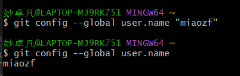
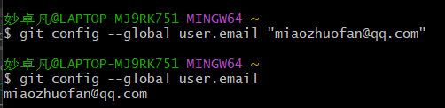

# heima-git
黑马git讲义(src/main/resources/doc/Git讲义.pdf)

1.本地安装git(https://git-scm.com/download)

2.运行git bash设置账号密码

`git config --global user.name "miaozf"`

`git config --global user.email "miaozhuofan@qq.com"`

3.预防乱码

`git config --global core.quotepath false`

在 ${git_home}/etc/bash.bashrc 加入

`export LANG="zh_CN.UTF-8"
export LC_ALL="zh_CN.UTF-8"`

4.  `git add .`
    
    `git commit -m""`

    `git status`

    `git log`

    
    

